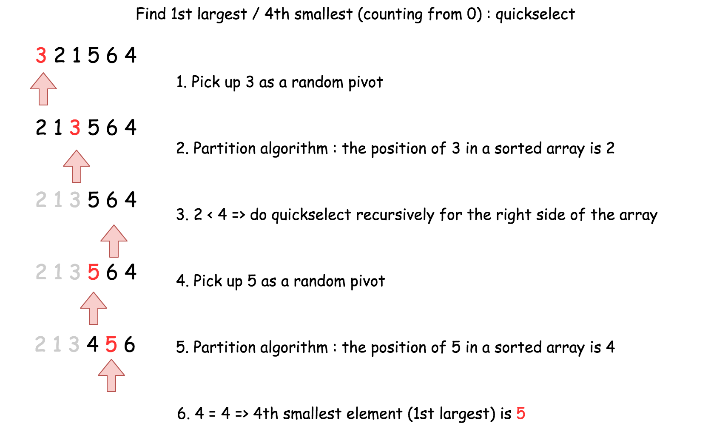

# Kth Largest Element in an Array

given an integer array nums and an interger k, return the kth largest element in the array. kth largest element in the sorted order, not the kth distinct element.
need solve it in O(n) time complexity 

input: nums=[3,2,1,5,6,4], k =2
output: 5

input: nums=[3,2,3,1,2,4,5,5,6], k =4
output: 4

## Heap

heap of smallest element first, add all elements from the array into heap one by one keep the size of heap <=k.-> heap containing k largest elements of the array.

the head of the heap is the answer.-> kth largest element of the array

```Python
def findKthLargest(self,nums:List[int],k:int)->int:
    res=[]
    for i in nums:
        #push the current element i into the res heap
        heapq.heappush(res,i)
        if len(res)>k:
            #remove the smallest element from res
            heapq.heappop(res)
    return res[0]
```

using min heap here could efficiently discard the smaller elements. at the end, the root of the heap is res[0] which will be the k-th largest element.
the time complexity is O(nlogk)

```Python
import heapq
def findKthSmallest(nums, k):
    res = []
    for i in nums:
        heapq.heappush(res, -i)  # Push negated elements to create a max-heap
        if len(res) > k:
            heapq.heappop(res)
    return -res[0]  # Negate the result to obtain the k-th smallest element

```

## Quickselect

O(n) time complexity
kth largest element is same as N-k smallest element
we could implement the k smallest algorithm for this problem.

1.   

```Python
import random

class Solution:
    def findKthLargest(self, nums, k):
        def select(left, right, k_smallest):
            if left == right:
                return nums[left]

            pivot_index = random.randint(left, right)
            pivot = nums[pivot_index]
            nums[pivot_index], nums[right] = nums[right], nums[pivot_index]

            store_index = left
            for i in range(left, right):
                if nums[i] < pivot:
                    nums[store_index], nums[i] = nums[i], nums[store_index]
                    store_index += 1

            nums[right], nums[store_index] = nums[store_index], nums[right]

            if k_smallest == store_index:
                return nums[k_smallest]
            elif k_smallest < store_index:
                return select(left, store_index - 1, k_smallest)
            else:
                return select(store_index + 1, right, k_smallest)

        return select(0, len(nums) - 1, len(nums) - k)

```