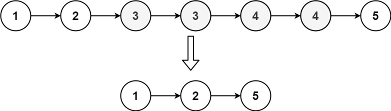

# Remove Duplicates from Sorted List ||

given the head of a sorted linked list,delete all nodes that have duplicate numbers,leaving numbers from the original list. return the linked list sorted as well.



## My approach

```Python
def delete(self,head):
    dummy = head
    while dummy:
        if dummy.val == dummy.next.val:
            dummy.next =dummy.next.next
    return dummy
```

## recursion Solution

有序链表所以一个节点出现了不止一次就把这个节点删掉。
因为有序所以如果一个节点出现了好多次必定相邻。

```Python
def delete(self,head):
    if not head and not head.next:
        return head
    # continue moving 
    if head.val != head.next.val:
       head.next = self.delete(head.next)
    else:
        move = head.next
        while move and head.val ==move.val:
            move = move.next
        return self.delete(move)
    return head
```

O(N) for both time and space

## Iterative
1.uses prseudo-head with zero value to ensure the delete first head situation happen, and all nodes to delete are inside the list.
2.the input list is sorted,can determined if a node is duplicate by compare it to node after it.

```Python
def delete(self,head):
    # no node or only has one node
    if not head or not head.next:
        return head
    # hold for the new head
    dummy=ListNode(0)
    dummy.next=head
    #handle case tht first node separately, if first node not duplicate, pre remain dummy, if duplicate, it can easier update pre to cur
    pre = dummy
    cur = head
    while cur:
        #cur point to the last elemetn at the end of duplicate element
        while cur.next and cur.val == cur.next.val:
            cur = cur.next
        #pre.next is the node before cur same as cur, if they are the same, no duplicate found
        if pre.next == cur:
            pre=pre.next
        else:
            pre.next = cur.next
        cur=cur.next
    return dummy.next
```
